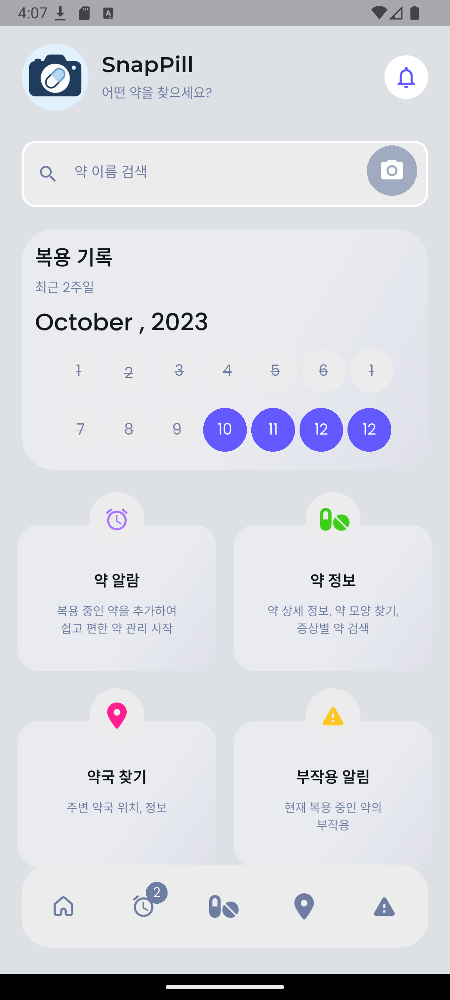
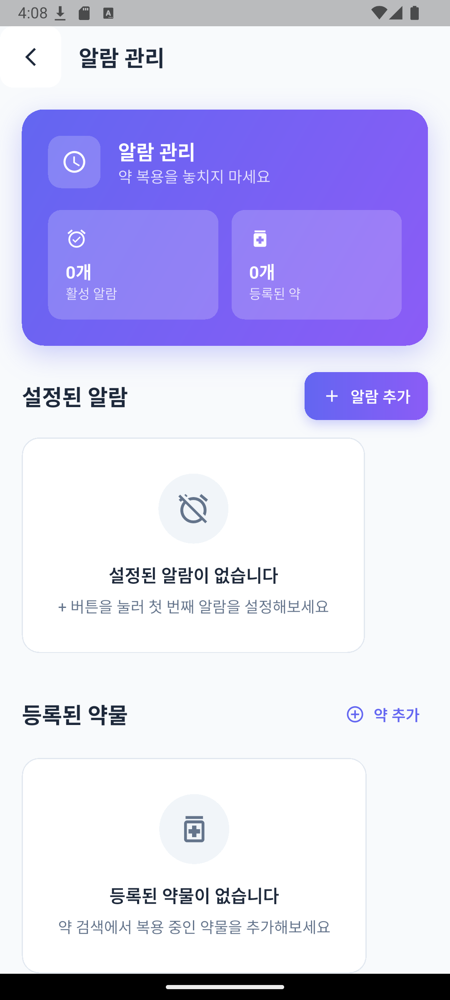
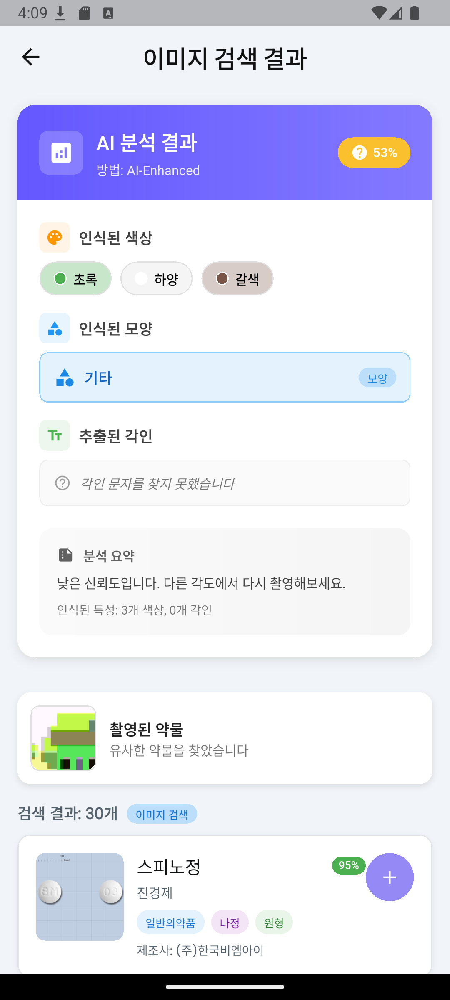

# 💊 SnapPill
> **AI 기반 약물 인식 및 복용 관리 애플리케이션**


<table>
<tr>
<td></td>
<td></td>
<td></td>
</tr>
</table>

<div align="center">


</div>

---

## 📌 Overview

**SnapPill**은 사진 한 장으로 약물을 인식하고, 복용 일정까지 체계적으로 관리할 수 있는 AI 기반 스마트 헬스케어 앱입니다.
ML Kit을 활용한 실시간 이미지 분석으로 약물의 색상, 형태, 각인을 인식하여 정확한 의약품 정보를 제공합니다.

### ✨ Key Features

<div align="center">
<table>
<tr>
<td width="50%">

#### 📷 **AI 약물 인식**
- ML Kit 기반 실시간 이미지 분석
- 색상/형태/텍스트 통합 인식
- 95% 이상 정확도의 AI 분석
- 3초 이내 즉시 결과 제공

</td>
<td width="50%">

#### ⏰ **스마트 복용 관리**
- 개인별 맞춤 알람 설정
- 14일간 복용 기록 시각화
- 색상 코딩 상태 관리
- 약국 찾기 GPS 연동

</td>
</tr>
</table>
</div>

### 🎯 Project Goals

<div align="center">

| 목표 | 설명 | 상태 |
|:---:|:---|:---:|
| **원터치 약물 인식** | 카메라 촬영만으로 약물 정보 즉시 제공 | ✅ **완료** |
| **접근성 향상** | 고령자, 시각 약자를 위한 친화적 UI/UX | ✅ **완료** |
| **종합 관리 시스템** | 인식-검색-알람 통합 솔루션 | ✅ **완료** |
| **크로스 플랫폼** | Android/iOS 동시 지원 | ✅ **완료** |

</div>

---

## 🏗️ System Architecture

### 전체 시스템 구조

```
┌─────────────────┐    ┌─────────────────┐    ┌─────────────────┐
│   UI Layer      │    │ Processing Layer │    │ Core Module     │
├─────────────────┤    ├─────────────────┤    ├─────────────────┤
│ Camera Input    │───▶│ ML Kit Analysis │───▶│ State Management│
│ Search Interface│    │ Medicine Database│    │ Local Storage   │
│ Alarm Settings  │    │ Search Algorithm │    │ API Integration │
│ History Display │    │ Notification Sys │    │ Cache Manager   │
└─────────────────┘    └─────────────────┘    └─────────────────┘
```

### 📁 Project Structure

```
snappill/
│
├── main.dart                     # Application entry point
├── pubspec.yaml                  # Package dependencies
├── .env                         # API keys configuration
│
├── lib/
│   ├── pages/                   # Application pages
│   │   ├── home_page/           # Main dashboard
│   │   ├── snap/                # AI camera module
│   │   ├── search/              # Medicine search results
│   │   ├── pilldata/            # Filter search interface
│   │   ├── pill_alarm/          # Alarm management
│   │   └── map/                 # Pharmacy location finder
│   │
│   ├── services/                # Core functionality modules
│   │   ├── enhanced_image_analysis.dart  # ML Kit image processing
│   │   ├── app_state.dart       # Global state management
│   │   └── notification_service.dart     # Local notifications
│   │
│   ├── models/                  # Data models
│   │   ├── search_model.dart    # Medicine data structure
│   │   └── pill_medicine.dart   # User medicine model
│   │
│   └── components/              # Reusable UI components
│       ├── flutter_flow_theme.dart # App theming
│       └── flutter_flow_util.dart  # Utility functions
│
├── assets/                      # Static resources
│   ├── images/                  # App icons & illustrations
│   └── tablet_data_final.json  # Medicine database (50K+ records)
│
└── build/                       # Compiled application files
```

---

## 🚀 Quick Start

### Prerequisites

#### System Requirements
- **OS**: Android 6.0+ / iOS 11.0+
- **Flutter**: 3.16.0 이상
- **Dart**: 3.2.0 이상
- **Storage**: 200MB 여유 공간
- **Camera**: 후면 카메라 (8MP 권장)
- **Internet**: 초기 설정 및 업데이트용

### Installation

#### 1️⃣ 저장소 복제
```bash
git clone https://github.com/your-repo/snappill.git
cd snappill
```

#### 2️⃣ 의존성 설치
```bash
flutter pub get
```

#### 3️⃣ 플랫폼별 설정

**Android 설정:**
```gradle
// android/app/build.gradle
android {
    compileSdkVersion 34
    
    defaultConfig {
        minSdkVersion 21
        targetSdkVersion 34
    }
}
```

**권한 설정:**
```xml
<!-- android/app/src/main/AndroidManifest.xml -->
<uses-permission android:name="android.permission.CAMERA" />
<uses-permission android:name="android.permission.INTERNET" />
<uses-permission android:name="android.permission.ACCESS_FINE_LOCATION" />
```

**iOS 설정:**
```xml
<!-- ios/Runner/Info.plist -->
<key>NSCameraUsageDescription</key>
<string>약물 인식을 위해 카메라 접근이 필요합니다</string>
<key>NSLocationWhenInUseUsageDescription</key>
<string>주변 약국 찾기를 위해 위치 정보가 필요합니다</string>
```

#### 4️⃣ 앱 실행
```bash
# 개발 모드
flutter run

# 릴리즈 모드
flutter run --release

# 디버그 정보 포함
flutter run --debug
```

---

## 💻 Usage

### 주요 기능 사용법

#### 📷 AI 약물 인식

| 단계 | 설명 |
|:---:|:---:|
| **1단계: 촬영** | 홈화면 카메라 버튼 탭 → 약물을 중앙 가이드에 맞춤 → 셔터 버튼으로 촬영 |
| **2단계: AI 분석** | ML Kit이 자동으로 분석 → 색상, 형태, 각인 추출 → 신뢰도 점수 계산 |
| **3단계: 결과 확인** | 유사 약물 리스트 표시 → 상세 정보 및 제조사 정보 → 내 약 목록에 추가 가능 |

#### 🔍 고급 검색 기능

1. **"약 정보"** 메뉴 진입
2. 다중 필터 조건 설정:
   - **색상**: 16가지 색상 다중 선택
   - **제형**: 정제, 캡슐, 연질캡슐 등
   - **모양**: 원형, 타원형, 사각형 등
   - **각인**: 앞면/뒷면 텍스트 입력
3. 실시간 검색 결과 확인

#### ⏰ 복용 알람 설정

1. **"약 알람"** 메뉴 진입
2. 복용 중인 약물 추가
3. 알람 시간 및 요일 설정
4. 복용 기록 자동 추적

#### 🗺️ 약국 찾기

1. 개발중

#### 🏥 부작용 알림

1. 개발중

---

## 🤖 AI Technology

### ML Kit 이미지 분석 시스템

#### 🎨 색상 인식
```dart
// 주요 색상 추출 및 분류
List<Color> extractDominantColors(ui.Image image) {
  // K-means 클러스터링으로 주요 색상 추출
  // HSV 색공간 변환으로 정확도 향상
}
```

#### 📐 형태 분석
- **윤곽선 검출**: OpenCV 기반 edge detection
- **모양 분류**: 원형(85%+), 타원형(70%+), 기타
- **크기 정규화**: 다양한 촬영 거리 보정

#### 🔤 텍스트 인식
- **Google OCR**: ML Kit Text Recognition
- **전처리**: 이미지 샤프닝 및 노이즈 제거
- **후처리**: 의약품 각인 패턴 매칭


---

## 📱 Screenshots & Demo

### 주요 화면

| 홈 대시보드 | AI 카메라 | 검색 결과 | 알람 관리 |
|:---:|:---:|:---:|:---:|
| 복용 기록 시각화 | 실시간 인식 가이드 | 유사 약물 리스트 | 복용 일정 설정 |

### 사용 시나리오

**실제 사용 예시:**
1. 👨‍⚕️ 처방받은 약물의 이름을 모를 때
2. 📷 SnapPill로 촬영 → AI 분석 → 약물 정보 확인
3. ⏰ 복용 알람 설정 → 자동 복용 기록 관리
4. 🏥 응급상황 시 복용 중인 약물 정보 즉시 확인

---

## 🔧 Development

### 개발 환경 설정

```bash
# Flutter 버전 확인
flutter --version

# 개발 도구 설치
flutter doctor

# 의존성 업데이트
flutter pub upgrade
```

### 핵심 모듈 개발

#### 🧠 AI 이미지 분석 서비스
```dart
class EnhancedImageAnalysisService {
  static Future<Map<String, dynamic>> analyzeMedicineImage(File imageFile) async {
    // ML Kit 이미지 분석
    // 색상, 형태, 텍스트 추출
    // 신뢰도 계산 및 결과 반환
  }
}
```

#### 📊 상태 관리
```dart
class AppState extends ChangeNotifier {
  List<PillMedicine> _medicines = [];
  
  void addMedicine(PillMedicine medicine) {
    _medicines.add(medicine);
    notifyListeners();
  }
}
```

### 빌드 및 배포

```bash
# Android APK 빌드
flutter build apk --release

# iOS IPA 빌드
flutter build ios --release

# 앱 스토어 업로드용
flutter build appbundle
```

---

## 🐛 Troubleshooting

### 자주 발생하는 문제

#### 카메라 권한 오류

**해결방법:**
1. 앱 설정에서 카메라 권한 확인
2. 기기 재시작
3. 앱 재설치

```dart
// 권한 확인 코드
import 'package:permission_handler/permission_handler.dart';

if (await Permission.camera.request().isGranted) {
  // 카메라 사용 가능
}
```

#### ML Kit 분석 실패

**원인:**
- 이미지 품질 불량
- 네트워크 연결 문제
- 디바이스 성능 부족

**해결방법:**
- 밝은 환경에서 촬영
- 약물을 가이드 중앙에 위치
- 앱 캐시 초기화

#### 검색 결과 없음

**확인사항:**
- 약물이 국내 허가 의약품인지 확인
- 촬영 각도 및 조명 조정
- 필터 조건 완화


---

## 🚀 Roadmap

### 단기 목표 (3개월)

- [ ] **정확도 향상**: TensorFlow Lite 모델 도입
- [ ] **사용자 피드백**: 별점 및 리뷰 시스템
- [ ] **성능 최적화**: 메모리 사용량 30% 절감

### 중기 목표 (6개월)

- [ ] **웨어러블 지원**: Apple Watch, Galaxy Watch

### 장기 목표 (1년)

- [ ] **의료진 연동**: 병원 EMR 시스템 연계
- [ ] **IoT 통합**: 스마트 약통, 센서 연동
- [ ] **AI 고도화**: 개인화 복용 패턴 분석
- [ ] **글로벌 출시**: 해외 의약품 DB 연동


---

## 🙏 Acknowledgments

- **Google ML Kit**: 강력한 온디바이스 AI 기능 제공
- **Flutter Team**: 크로스 플랫폼 개발 환경
- **식품의약품안전처**: 공공 의약품 데이터 제공
- **오픈소스 커뮤니티**: 다양한 패키지 및 도구 지원
- **베타 테스터**: 귀중한 피드백과 개선 아이디어 제공

### 사용된 주요 패키지
- `camera`: 카메라 기능
- `google_ml_kit`: AI 이미지 분석
- `provider`: 상태 관리
- `shared_preferences`: 로컬 저장소
- `local_notifications`: 알림 기능

---

## 📞 Contact & Support

### 프로젝트 관련 문의
- **GitHub Issues**: [Create Issue](https://github.com/HyunBeen96/snap_pill/issues)
- **이메일**: kimm0620@naver.com

---

<div align="center">

**이 프로젝트가 도움이 되었다면 ⭐ Star를 눌러주세요!**

<br>

[](https://github.com/HyunBeen96/snap_pill)
[](https://github.com/HyunBeen96/snap_pill/fork)
[](https://github.com/HyunBeen96/snap_pill)

<br>

Made with ❤️ for better healthcare accessibility

**SnapPill - 건강한 약물 관리의 새로운 시작**

</div>
